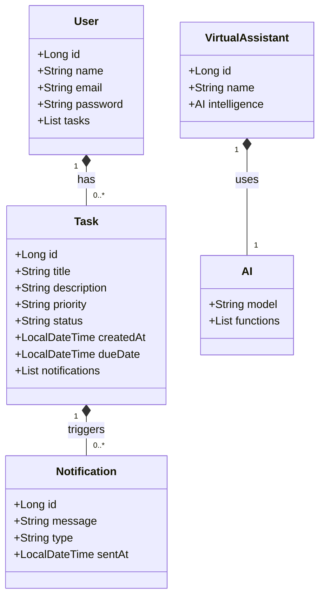

# Assistente Virtual

```mermaid
classDiagram
    class User {
        +Long id
        +String name
        +String email
        +String password
        +List<Task> tasks
    }

    class Task {
        +Long id
        +String title
        +String description
        +String priority
        +String status
        +LocalDateTime createdAt
        +LocalDateTime dueDate
        +List<Notification> notifications
    }

    class Notification {
        +Long id
        +String message
        +String type
        +LocalDateTime sentAt
    }

    class VirtualAssistant {
        +Long id
        +String name
        +AI intelligence
    }

    class AI {
        +String model
        +List<String> functions
    }

    User "1" *-- "0..*" Task : has
    Task "1" *-- "0..*" Notification : triggers
    VirtualAssistant "1" *-- "1" AI : uses
```
